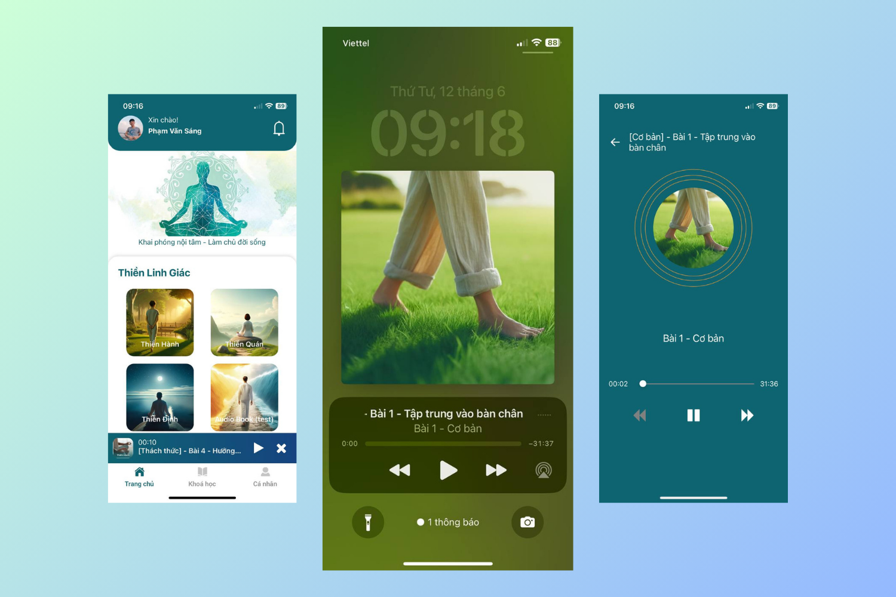
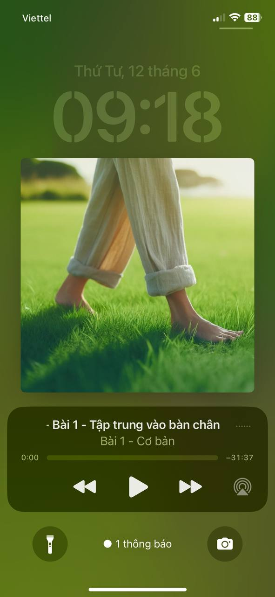
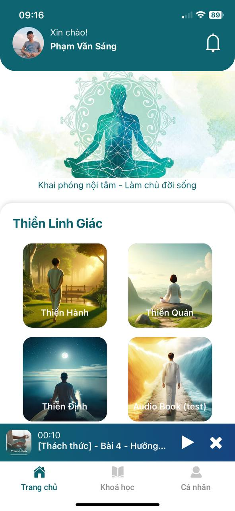
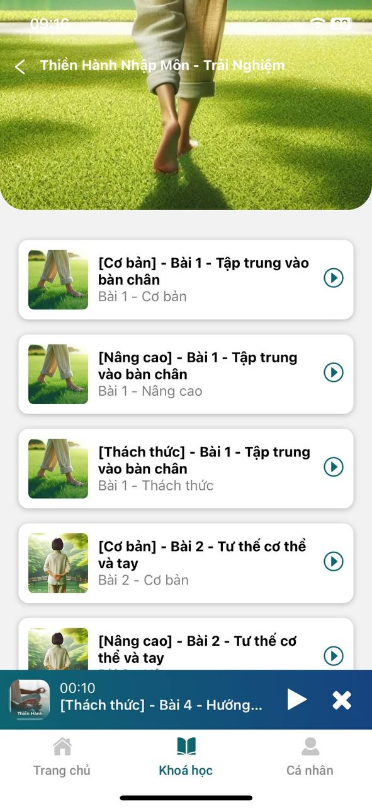
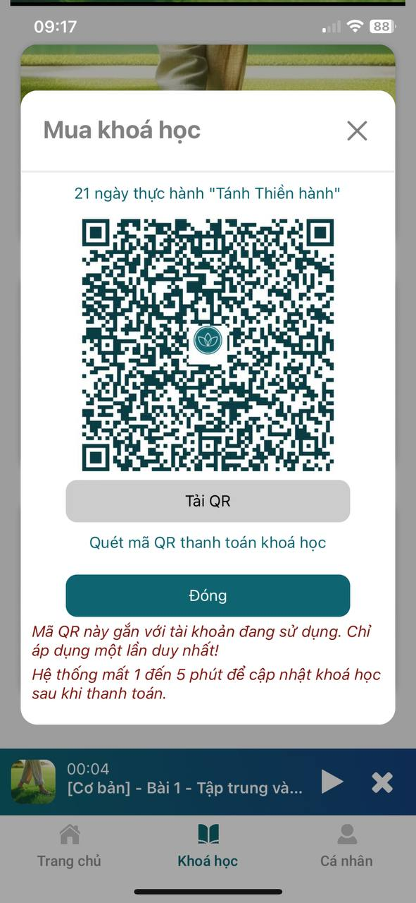
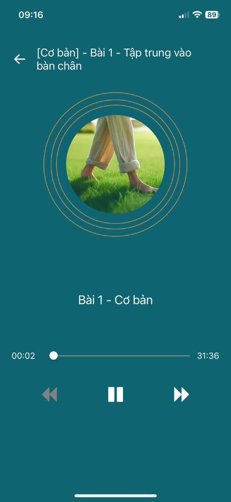
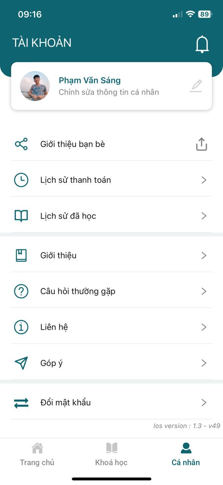
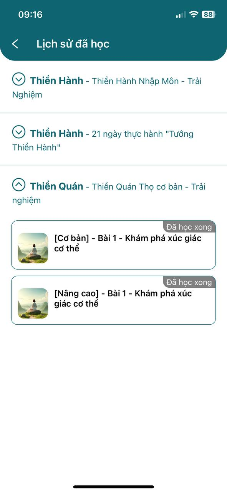

# Enhance concentration and improve health

“Khai phóng” is an application that helps users relieve stress and improve concentration through meditation exercises. The application provides courses according to the roadmap, users can easily listen and manage lessons.

## Main functions

- Register an account
- Buy paid courses (with QR)
- Listen to meditation through audios
- Payment history, learned history
- Update account, comment, share,...

## Technologies

- React native -- Axios -- Camera -- React hook -- Redux toolkit -- Youtube -- Track player -- Reanimated -- Firebase auth -- Notification -- Typescripts

## Links

- IOS: [https://apps.apple.com/us/app/khai-ph%C3%B3ng/id6502045780](https://apps.apple.com/us/app/khai-ph%C3%B3ng/id6502045780)
- Android: [https://play.google.com/store/apps/details?id=com.flink.khaiphong](https://play.google.com/store/apps/details?id=com.flink.khaiphong)

## Screenshots

## Demo

<h6>To view source code, please contact email: sangphamvan.dev@gmail.com</h6>
